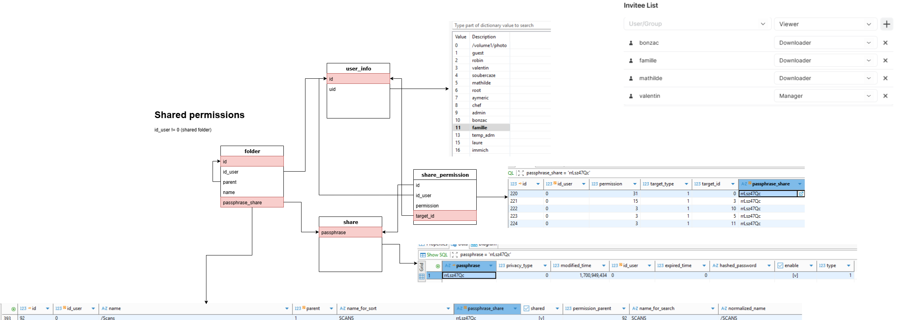

# Synology Photos Shared Folder Permissions - Reverse Engineering

## Background & Pain Point

Synology Photos manages user permissions using its own internal database, not the filesystem ACLs. This means:

- Users with read access to the `/photos` shared folder on the filesystem (e.g., via SMB/SAMBA) can see **all photos**, regardless of the restrictions set in Synology Photos.
- In Synology Photos, users only see the photos and folders they have been explicitly authorized to access, as defined in the Photos database.

**Pain Point:** There is a mismatch between what users can access via the filesystem and what they are allowed to see in Synology Photos. This can lead to privacy or security issues, as users may access files outside their intended scope if they use direct filesystem access.

**Goal:** The intention of this project is to find a way to align Synology Photos permissions (as managed in its database) with the actual filesystem ACLs/permissions, so that access is consistent whether users access photos via Synology Photos or directly through the filesystem.

## Use Cases

### Immich Integration with User-Specific Permissions
A practical example of this solution is deploying **Immich** (self-hosted photo management) to access photos through SAMBA while respecting Synology Photos user permissions. 

With this implementation:
- Immich can connect to the Synology via SAMBA using specific user credentials
- Each user's Immich instance will only see photos they're authorized to access in Synology Photos
- The filesystem permissions automatically enforce the same access controls as the Synology Photos application
- No need to maintain duplicate permission structures or worry about users accessing unauthorized content

This enables seamless integration between Synology Photos' permission system and external applications that access photos through standard filesystem protocols.

## Reverse Engineering Setup: Extracting and Importing the Synology Photos Database

To analyze and reverse engineer Synology Photos permissions, the first step is to extract the database from your Synology NAS and import it into a local PostgreSQL instance for inspection.

### 1. Extract the Database from Synology NAS

Run the following commands on your Synology as root:

```sh
# as root
mkdir /volume1/pg_dump
chown postgres: /volume1/pg_dump
su - postgres
cd /volume1/pg_dump
pg_dump synofoto > synofoto.sql
```

This will create a SQL dump of the `synofoto` database.

### 2. Import into Local PostgreSQL (using Docker Compose)

Create a `docker-compose.yml` file with the following content:

```yaml
services:
  db:
    image: postgres:15
    container_name: synofoto-db
    restart: unless-stopped
    environment:
      POSTGRES_USER: syno
      POSTGRES_PASSWORD: synopass
      POSTGRES_DB: synofoto
    ports:
      - "5432:5432"
```

Start the database:

```sh
docker-compose up -d
```

Copy the SQL dump into the container:

```sh
docker cp ./synofoto.sql synofoto-db:/tmp/synofoto.sql
```

Prepare the import (create the required role):

```sh
docker exec -u postgres synofoto-db psql -d synofoto -c 'CREATE ROLE "SynologyPhotos";'
```

Import the database dump:

```sh
docker exec -it synofoto-db bash
psql -U syno -d synofoto -f /tmp/synofoto.sql
```

## Database Schema Overview

The main tables involved are:

- `folder`: Contains folder metadata. Shared folders have `id_user = 0`.
- `share_permission`: Stores permissions for users/groups on shared folders, linked via `passphrase_share`.
- `user_info`: Stores user information (id, uid, name).

## Permission Mapping

- Permissions are stored as bitmaps in the `permission` column (e.g., 3 for view, 7 for download, 15 upload, 31 for manage)
- Each row in `share_permission` links a user/group (`target_id`) to a shared folder via `passphrase_share`.

## How to Extract User Permissions for a Shared Folder

To list all users with permissions on a shared folder of id = 92 (excluding system user 0):

```sql
SELECT sp.target_id AS user_id, ui.uid AS username, ui.name AS user_fullname, sp.permission
FROM share_permission sp
JOIN user_info ui ON sp.target_id = ui.id
JOIN folder f ON f.passphrase_share = sp.passphrase_share
WHERE f.id = 92 AND sp.target_id != 0 AND sp.permission > 0;
```

For folder id = 92, the query returns:

| user_id | username | user_fullname | permission |
|---------|----------|---------------|------------|
| 3       | 1026     | valentin      | 15         |
| 10      | 1033     | bonzac        | 3          |
| 5       | 1028     | mathilde      | 3          |
| 11      | 1029     | famille       | 3          |

And here was the source:


## How to apply those permissions to Filesytem (used for SAMBA/SMB etc.)

✅ **COMPLETED** - The solution has been implemented with a comprehensive set of scripts.

### Core Scripts

#### `sync_permissions.sh` - Individual Folder Synchronization
Synchronizes filesystem ACLs with database permissions for a specific folder. Usage:
```bash
./sync_permissions.sh [FOLDER_ID]
```

**Key Features:**
- Aligns database permissions with filesystem ACLs for read-only access
- Handles complex parent-child folder permission hierarchies
- Implements intelligent path traversal with execute-only permissions
- Preserves system security by granting only read access regardless of database permission level

#### `permission_audit.sh` - Coherence Validation
Ensures coherence between database permissions and filesystem access. Usage:
```bash
./permission_audit.sh                    # Full detailed audit (default)
./permission_audit.sh summary            # Quick overview without detailed folder output
./permission_audit.sh folder <FOLDER_ID> # Audit specific folder
./permission_audit.sh user <username>    # Audit specific user across all folders  
./permission_audit.sh debug <FOLDER_ID>  # Debug ACL details for specific folder
```

**Features:**
- Comprehensive validation of permission alignment
- Detailed reporting of mismatches and inconsistencies
- Summary mode for quick system-wide overview
- Tracks execute-only permissions for path traversal

#### `batch_sync.sh` - System-wide Processing
Processes all shared folders in the database automatically. Usage:
```bash
./batch_sync.sh           # Normal mode with full output
./batch_sync.sh --silent  # Silent mode (minimal output, errors only)
```

**Features:**
- Discovers all shared folders from the database
- Processes each folder sequentially with full logging
- Handles edge cases where folders are processed before knowing child requirements
- Automatic log rotation and comprehensive error handling
- Silent mode for automated scheduling

### Advanced Permission Handling

#### Path Traversal and Execute Permissions
The system implements sophisticated path traversal logic:

- **Parent-Child Re-evaluation**: Because folders are processed before knowing if they have child folders requiring different permissions, the system recalculates permissions from top parent to child at each level
- **Execute-Only Trick**: Users who need access to child folders but not parent folders receive execute-only (`x`) permissions on parent directories, allowing navigation without granting read access to parent content
- **Dynamic ACL Adjustment**: Parent deny rules are replaced with execute-only permissions when users need traversal access to reach authorized subfolders

Example: If user `bonzac` has access to `/Scans/Family` but not `/Scans`, the system grants:
- Execute-only permission on `/Scans` (for traversal)
- Full read permission on `/Scans/Family`

#### Security Model
- **Read-Only Alignment**: All filesystem permissions are read-only, regardless of database permission level (view, download, upload, manage)
- **Minimal Privilege**: Users receive only the minimum filesystem permissions needed to access their authorized content
- **System Preservation**: System ACL rules are preserved and never modified

### Default Usage Pattern
For regular maintenance, run:
```bash
./batch_sync.sh && ./permission_audit.sh summary
```

For automated/scheduled runs:
```bash
./batch_sync.sh --silent && ./permission_audit.sh summary
```

This will:
1. Synchronize all shared folder permissions system-wide
2. Provide a summary audit to verify coherence

**Tested and validated** system-wide.

## Automated Scheduling (Recommended)

### Nightly Automated Sync and Audit
For production environments, it's recommended to run the sync and audit automatically on a nightly basis using Synology's built-in Task Scheduler.

#### Setup Synology Scheduled Task
1. **Access Synology DSM**: Log into your Synology DSM as administrator
2. **Open Task Scheduler**: Go to Control Panel → Task Scheduler
3. **Create New Task**: Click "Create" → "Scheduled Task" → "User-defined script"
4. **Configure Task**:
   - **Task Name**: `Synology Photos Permission Sync`
   - **User**: `root`
   - **Schedule**: Daily at 2:00 AM (or preferred time during low usage)
   - **Task Settings** → **User-defined script**:
   ```bash
   /volume1/tools/Synology/synology-photos-shared-permissions/nightly_sync_audit.sh
   ```
   - **Settings** → **Send run details by email**: ✅ **Enabled**
   - **Send run details only when the script terminates abnormally**: ✅ **Enabled**

#### Automatic Email Notifications
Synology's Task Scheduler automatically handles email notifications:
- ✅ **Silent on Success**: No email sent when script exits with code 0
- 📧 **Alert on Issues**: Sends email notification when script exits with code 1:
  - Batch sync failures
  - Permission audit detects misalignments
  - Includes full script output and error details

#### What the Nightly Script Does
1. **Batch Sync**: Runs `./batch_sync.sh --silent` to align all folder permissions
2. **Permission Audit**: Runs `./permission_audit.sh summary` to verify alignment
3. **Return Codes**: 
   - Exit 0: All permissions perfectly aligned (no email)
   - Exit 1: Issues detected (triggers Synology email notification)
4. **Log Management**: Automatically rotates logs, keeping last 30 days

#### Manual Testing
Test the scheduled task manually:
```bash
# Test the nightly script
sudo /volume1/tools/Synology/synology-photos-shared-permissions/nightly_sync_audit.sh
[2025-07-29 15:52:12] Starting nightly Synology Photos permission sync and audit
[2025-07-29 15:52:12] Running batch permission sync...
[2025-07-29 16:02:10] Batch sync completed successfully
[2025-07-29 16:02:10] Running permission audit...
[2025-07-29 16:04:00] Permission audit completed - All permissions aligned

# Check exit code
echo "Exit code: $?"
```

#### Monitoring Logs
All nightly runs are logged to:
```
logs/nightly_sync_audit_YYYYMMDD_HHMMSS.log
```

## Directory Structure

The project is organized with the following structure:

### Core Scripts (Root Directory)
- `sync_permissions.sh` - Individual folder synchronization
- `permission_audit.sh` - Coherence validation
- `batch_sync.sh` - System-wide processing
- `nightly_sync_audit.sh` - Automated scheduling script

### Tools Directory (`tools/`)
Development and testing utilities:
- `extended_test.sh` - Extended testing scenarios
- `simple_test.sh` - Basic functionality tests
- `test_problematic_folders.sh` - Edge case testing
- `validate_permissions.sh` - Permission validation utility
- `fix_ownership.sh` - **PhotoStation migration cleanup**: Fixes orphaned folders from PhotoStation → Synology Photos migration (UID 138862). Run this after migration to clean up unattached folders before permission synchronization.

### Logs Directory (`logs/`)
All execution logs are automatically stored here with timestamped filenames.

## Conclusion

This approach allows you to enumerate all users with access to a shared folder in Synology Photos, along with their permission levels, by querying the underlying database.